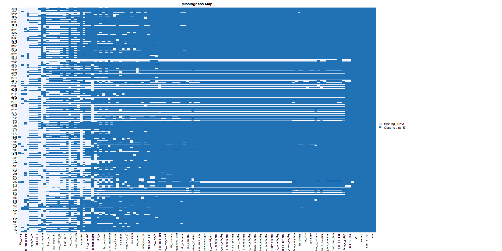
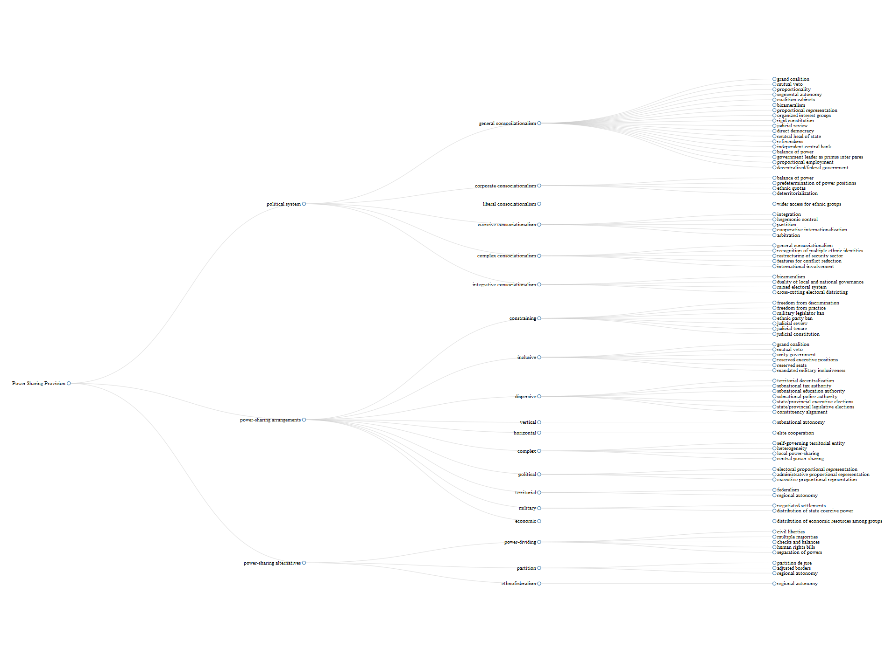

```{=latex}
\newlength\cbl
\newenvironment{codebook}[1][rob\_avprison1]{
    \settowidth{\cbl}{#1}
    \parskip1em plus .3em minus .2em
    \parindent0pt
    \def\code##1##2{{\bfseries ##1}\hfill
        \parbox[t]{\dimexpr\linewidth-15em-\cbl}{##2}\par}}{\noindent}
```

<style type="text/css">
  body{
  font-size: 14pt;
}
</style>

\pagenumbering{arabic}

\abstract

How can we better understand the effects of segmental autonomy on social trust, conflict rates, and democratization? I analyze the substantive effects of segmental autonomy across a range of polities from 1980 through to 2018. Segmental autonomy operates by proliferating the number of political focal points in a state, targeting concessions to regional minorities, and allowing those minorities to serve as checks and balances on the central government. The need to study the individual provisions of power-sharing arises from a lack of consensus regarding how power-sharing is measured and conceptualized. As such, quantitative and qualitative reviews of the effectiveness of power-sharing agreements seem difficult to reconcile. In addition to assessing the impacts of segmental autonomy, I offer a conceptual mapping of the forms of power-sharing in terms of their provisions in order to better understand the relationship between these concepts. In doing so, I generate an empirical framework within which other provisions of power-sharing may be better understood. Though my overall results provide mixed support for my hypothesis, qualitative and quantitative evidence suggests that the implementation of segmental autonomy---as a standalone provision or alongside other provisions of power-sharing---is associated with the modest democratic improvements purported in the existing literature. In disaggregating the broad conceptions of power-sharing we are able to both improve generalizability and allow for accumulated findings moving forward. 

\newpage

<!---\tableofcontents

\listoffigures

\listoftables--->

\newpage

\doublespacing

\section{Introduction}
In 2018, the warring parties in South Sudan signed the Revitalized Agreement on the Resolution of the Conflict in the Republic of South Sudan (R-ARCSS). This document re-establishes a transitional government, a truth commission, and outlines the general provisions of the new government. Among those provisions, the agreement calls for the recognition of thirty-two counties---drawn to accommodate the various ethnic groups in the state---and grants them substantial autonomy.\footcite{intergovernmental_authority_on_development_agreement_2015, vhumbunu_reviving_2019} The people of South Sudan, having been in the midst of ethnically-driven conflict since 2013, view this agreement with cautious optimism. Though a similar reserve is shared by signatories of the agreement and international observers, many believe that the extent of the agreement's inclusivity, and its significant local and regional ownership, are likely to create peace following its implementation.\footcite{vhumbunu_reviving_2019, njoroge_status_2019} 

South Sudan, in proposing the implementation of regional autonomy for their thirty-two counties, joins a growing number of ethnically diverse states in employing power-sharing institutions. These broadly defined institutions are designed to address a number of issues associated with emerging democracies, especially those with salient ethnic cleavages.\footcite{horowitz_ethnic_1985, lijphart_consociational_1969, esman_management_1973, nordlinger_conflict_1972} First, power-sharing is designed to accommodate ethnic group demands through devolving power to subnational factions. Second, and often as an alternative to devolution, power-sharing can help integrate regional groups into a central government. This often takes the form of coalition cabinets or reserved executive positions for certain groups. In both cases, power-sharing is a tool to abate conflict, lessen tensions among politically salient ethnic or minority actors, and ultimately help states transition into full democracy. While, at present, uncertainty surrounds the political trajectory of South Sudan, we see power-sharing presented as a plausible solution to conflict in an ethnically fractious society. 

The case of South Sudan highlights two issues associated with the power-sharing literature. First, it is difficult for scholars to draw meaningful conclusions on the effectiveness of power-sharing, consociationalism, and other forms of nation-building, when the concepts themselves are subjective and contested. This conceptual disparity hinders our ability aggregate results and generate cumulative findings.\footcite{dunning_information_2020} Second, there is a paucity of micro-level analysis focusing on the disaggregated provisions of power-sharing institutions. We do not know, for example, whether certain individual arrangements are more likely to cause peace than others nor in what ways these arrangements work. This paper sets out to address and reconcile these gaps in the literature by first analyzing the substantive effects of an individual provision of power-sharing and second, by establishing a framework which will allow for cumulative and more generalizable findings moving forward. 

Though many concepts in the comparative politics literature face some level of conceptual disagreement, other concepts do not suffer from the same magnitude of terminological ambiguity. Recent large-N studies of power-sharing have sought to standardize the concept to a degree, though the same issues exist when one compares these datasets. For example, Strom et al. (2017) encapsulate the universe of power-sharing cases by categorizing them into inclusive, dispersive, and constraining agreements. Conversely, Jarstad and Nilsson (2008) have coded their IMPACT database to distinguish political, military, territorial, and economic power-sharing agreements. While these large datasets do an  job of covering power-sharing institutions, they are not reproducible when applying the measurements from other works, though they purportedly analyze the same concepts. Despite the noticeable variation in the existing conceptions of power-sharing, there is a great deal of overlap within the provisions stipulated by consociational political systems and power-sharing accords. These provisions have yet to be studied in great depth, though doing so could allow one to empirically compare forms of power-sharing. As such, one may be able to both evaluate their effectiveness and understand in which contexts these provisions are most prevalent. 

Broadly speaking, power-sharing falls into two camps. Firstly, when certain power-sharing provisions are embedded in, or amended into, a constitution, we have what is generally understood to be consociational democracy. States that are often cited as being consociational in nature include the Netherlands from 1917 to 1967, Cyprus from 1960 to 1963, and Lebanon from 1943 to 1975, and from 1989 onwards.\footcite{andeweg_consociational_2000, lijphart_consociational_1977, picard_political_2000} Secondly, non-consociational power-sharing provisions can be written into a peace agreement following a conflict. This is what the more recent literature focuses on.\footcite{strom_inclusion_2017, graham_safeguarding_2017, jarstad_words_2008, mukherjee_why_2006} Power-sharing in these instances are implemented via accord and address civil tensions in a given state. Agreements can be, as Hartzell and Hoddie (2003, 2007) suggest, political, economic, territorial, or military in nature. While consociational democracy differs conceptually from power-sharing institutions found in peace accords, they serve the same purpose---that is, to ensure peace within socially diverse states---and their underlying provisions often overlap.

Disaggregating the provisions of power-sharing allows for two novel areas of exploration. Firstly, it allows for the standardization of previous conceptions of power-sharing, power-dividing, and partition, which in turn allows for, to some degree, the comparison and reconciliation of the vast literature on peacebuilding and institutional design. Secondly, assessing the provisions of power-sharing allows for a deeper understanding of which provisions are used, in which contexts they are implemented, and which provisions may be the most effective for ensuring lasting peace, preserving democracy, and reducing intergroup tensions. Thirdly, disaggregation, as I will discuss more thoroughly in Chapter 5, uncovers the issue of inconsistent measures between these micro-level provisions. As if a microcosm of the issues associated with the broad conceptions of power-sharing, measurements of the various disaggregated provisions exhibit low correlation between supposedly similar concepts, and generate completely different outcomes when analyzed in parallel. 

One provision that warrants particular analysis is segmental autonomy. Sometimes referred to as regional autonomy, it is a form of decentralization that grants specific powers to minority, geographically constrained, groups.\footnote{It is worth noting that segmental autonomy is \textit{not} the same as federalism. For an in-depth study of the relationship between regional autonomy and federalism, see \cite{lluch_autonomism_2012}.} Given that segmental autonomy has a far broader conception than, say, mutual veto, there are markedly more polities that exhibit some form of segmental autonomy over time. Perhaps more importantly, regional autonomy appears in several authors' typologies of power-sharing, allowing us to transcend these constraining conceptualizations. This allows for the expansion of Ram and Strom's (2014) approach to analyzing power-sharing provisions, while also moving away from a reliance on case-study and summary statistics toward more rigorous quantitative methods.

Segmental autonomy was first conceptualized by Lijphart as a provision allowing groups to "transcend cleavages and to join in a common effort with the elites of rival subcultures".\footcite[216]{lijphart_consociational_1969} In essence, by granting minority groups some level regional autonomy, cross-cutting social cleavages, and officially recognizing these newly autonomous groups, the provision serves as a concession to those groups and thus abates tension and conflict. Lijphart expands upon this idea in later works, highlighting the importance of the minorities' rule over itself, and adds that segmental autonomy can be implemented in a territorial or non-territorial federation, or a political system that allows for substantial delegation to segmental groups.\footcite{lijphart_consociational_1977, lijphart_non-majoritarian_1985} 

Through analyzing the disaggregated forms of power-sharing, we are able to ask new questions about the nature of power-sharing. Specifically, I ask two questions pertaining to segmental autonomy and its effect on prolonged peace, democratization, and social trust. A second set of outcomes concerns individuals' perceptions of the political system of their state. Building off of existing studies, I theorize that segmental autonomy operates in three distinct ways: through proliferating political focal points; through targeting concessions toward regional minorities; and by allowing regional groups to serve as checks and balances on the central government. Given these mechanisms, I hypothesize that the implementation of segmental autonomy exerts a positive effect on prolonged peace, a state's level of democracy, and reduced social tension within a given society. Existing studies of power-sharing and consociationalism produce mixed results regarding its effectiveness, though many qualitative case-study analyses seem to point to the possibility that power-sharing in certain circumstances can be effective. By developing a framework in which to analyze the provisions themselves, I will be able to uncover which provisions are most effective at causing peace and why. I add to my initial hypothesis by looking at the effects of segmental autonomy when employed alongside other power-sharing components. This hypothesis is borne from Norris's (2008) argument that power-sharing is moderated by multiple provisions, insofar as the impact of power-sharing is magnified when more provisions are implemented. My study extends this claim by looking at the interaction effects of the provisions and understanding which are the most effective in relation to my outcome variables.

In order to study the substantive effects of segmental autonomy, I generate a dataset that covers various provisions of power-sharing from 1975 to 2010 for 183 distinct countries. I then identify three distinct dependent variables that serve to evaluate the effectiveness of those provisions: democracy scores, social trust indices, and conflict rates. Using ordinary least squares regression and Cox survival models, I find mixed evidence for my hypotheses. Segmental autonomy is positively associated with democratization. From a policy perspecitve, these findings suggest that effectively combatting deep-rooted ethnic grievances necessitates a mix of dispersive and integrative methods. From an academic perspsective, the disaggregated approach to studying power-sharing will hopefully allow scholars to better identify exactly which provisions are most effective in generating positive outcomes for citizens.  

This paper contributes to the growing body of large-N quantitative studies on power-sharing in three ways. First, this paper allows for a better understanding of substantive effects of segmental autonomy from a global perspective using several different---and formally competing---measures of its success. Second, it allows us to study segmental autonomy in relation to other provisions of power-sharing as opposed to relying on broad conceptions. This allows us to understand interaction effects, and cases where the implementation of multiple provisions is more beneficial than just one form of power-sharing. Third, this paper proposes a methodological framework for analyzing the provisions of power-sharing moving forward. A nascent body of literature emphasizes the importance of improving the generalizability of studies---particularly those of an experimental nature---and the need for more replication in the social sciences.\footcite{dunning_information_2020, dunning_replicate_2014} In the same vein, this paper can be seen as an attempt to enhance the external validity of observational research. 

The remainder of this paper is structured as follows. Chapter 2 covers the existing formulations of regional autonomy in more depth and introduces my conceptual map of the power-sharing literature, broken down by the components that make up the broader concepts. Chapter 3 presents my theoretical framework and my hypotheses. Chapter 4 applies this theoretical framework using a paired case study of Mali, which implemented regional autonomy in 1999, and Niger, which did not engage in any form of decentralization. Chapter 5 summarizes the data collection process for both the ontology and the Provisions of Power-Sharing (PSP) dataset, as well as the statistical methods used to analyze the data. Chapters 6 and 7 present the results of my statistical analysis as well as a discussion of my findings and potential trajectories of future research. 

\section{Conceptualizing Power-Sharing} 
The concept of consociationalism was promulgated by Arend Lijphart in his seminal work "Consociational Democracy". Lijphart develops his own typology of existing democratic structures, stating that "[c]onsociational democracy means government by elite cartel designed to turn a democracy with a fragmented political culture into a stable democracy," and outlining several favorable conditions of consociationalism's success.\footcite[216]{lijphart_consociational_1969} The core provisions include segmental autonomy, mutual veto, grand coalition, and proportionality, though Lijphart's typology has expanded since its inception. It has been met with intense scrutiny over the years, with particular attention paid to its tautological nature, extensive and fluid conditions for success, and various country case studies where consociationalism has apparently failed.\footcite{andeweg_consociational_2000, bogaards_favourable_1998, seaver_regional_2000, tull_hidden_2005} Debates surrounding consociationalism seem to serve as a microcosm for the debates on power-sharing writ large as Andeweg (2000) states that "the level of abstraction of many contributions to (and critiques of) consociationalism is rather low, perhaps because the theory has largely been developed inductively from empirical case studies".\footcite[531]{andeweg_consociational_2000} Existing studies range from the necessity of consociationalism in ethnofederal polities,\footcite{lijphart_consociational_1969, lijphart_consociational_1977, oleary_debating_2005} to the modes which purportedly ensure a successful implementation of a peace pact,\footcite{walter_committing_2002, walter_explaining_2003, hartzell_institutionalizing_2003, hoddie_civil_2003, mukherjee_why_2006} to the tautological nature, and irrelevance, of consociational and power-sharing practices.\footcite{andeweg_consociational_2000, bogaards_favourable_1998, roeder_sustainable_2003} Some go as far as to argue that consociationalism serves as a platform for fundamentalism and may actually provoke ethnic conflicts, though the pro-consociational camp make the same argument for integrationist policies.\footcite{oleary_debating_2005} There is plenty of disagreement over power-sharing's effectiveness and whether it is required at all. 

As mentioned, perhaps the most striking issue associated with the concept of power-sharing is its fluidity. There is no clear differentiation between consociationalism, power-sharing, power-dividing, and partition. The purpose of power-sharing is also disputed, with many authors using different formulations of the dependent variable. Of the recent empirical literature, the authors highlight entirely different conceptions of power-sharing.\footcite{hartzell_institutionalizing_2003, hartzell_crafting_2007, graham_safeguarding_2017, jarstad_words_2008, mattes_fostering_2009, strom_inclusion_2017, walter_committing_2002} Hartzell and Hoddie (2003, 2007) suggest that multidimensional power-sharing institutions, that is, those institutions with several power-sharing provisions, are more likely to see positive results regarding democratization and cessation of conflict than fewer, though fail to explore in depth the provisions themselves.\footcite[325-332]{hartzell_institutionalizing_2003}

More pertinent to my own study, there is a slowly growing body of literature that focuses on the comparison and reconciliation of the various power-sharing datasets and the consolidation of the various conceptions of power-sharing institutions and political systems. There is also at least one study on an individual provisions of power-sharing. Given the data that exist, studying the provisions of power-sharing is problematic. As Ansorg et al. (2013) note, of the two-hundred and fifty-seven datasets on institutions and conflict in divided societies, "[t]ransparency was an issue for 28.4 percent of [them]".\footcite[12]{ansorg_mind_2013} Many do not have codebooks, there are few sources referenced, and detailed operationalization is lacking. As such, any attempt to compare findings of the success of power-sharing, as well as the actual contents of the power-sharing institutions, is challenging. The issues of vague data are less pertinent with the large country-level datasets such as the Database of Political Institutions (DPI), Varieties of Democracy (V-DEM), and Quality of Governance (QOG), but are far more prevalent in datasets created for the purpose of academic articles.\footnote{With the latter, in some cases, links and references to data used in the paper are broken, and codebooks unfinished, and one dataset used in a successful book on power-sharing institutions has over sixty-nine percent missingness.} Further, Binningsbo (2013) compares recent quantitative and causal approaches to power-sharing, arguing that while the designs are similar, "they use somewhat different reasoning explaining the relationship" between power-sharing, peace, and democratization.\footcite[101]{binningsbo_power_2013} While it is undoubtedly necessary for nuanced approaches to be taken in order to better understand the causes, outcomes, and conditions of power-sharing, these studies exist in their own defined universes, making comparison and cross-validation somewhat challenging. Strom et al. (2017) note a similar issue: "[o]nce we recognize that powersharing can be disaggregated in such ways, however, it is entirely possible that its different components do not always work in concert or reinforce one another".\footcite[6]{strom_inclusion_2017} Though they agree with Binningsbo (2013) on the possibility of disaggregation, the roles of the provisions, and their overlap with the various conceptions of power-sharing, is not explored further. 

One recent paper by Ram and Strom (2014) uses this disaggregated approach to power-sharing. They focus on analyzing one type of consociational provision---mutual veto---and their findings are both enlightening and warrant further exploration into the other provisions of consociational democracy and power-sharing agreements. Their initial findings seem to undermine, or at least disagree with, the current debate on consociationalism. While the debate focuses on consociationalism as either a panacea for fractious societies or an inevitable roadblock to democratic survival, Ram and Strom (2014) find that, in the case of mutual veto, the provisions of consociationalism are simply not common. "[M]utual veto provisions are a rare form of power-sharing," they suggest, and only eleven polities have implemented such provisions between 1975 and 2010.\footcite[345]{ram_mutual_2014} Descriptively, states that have employed mutual veto provisions have experienced mildly reduced conflict rates, yet, somewhat counterintuitively, mutual veto provisions are "most common in relatively prosperous and institutionally stable societies".\footcite[355]{ram_mutual_2014} It is interesting, then, that Lijphart and others would be so adamant of the essentiality of mutual veto provisions in consociational democracy in spite of their minimal prevalence and their emergence in non-conflictual democracies. We can assume that the success of consociational systems, and other power-sharing arrangements, must emerge from some sort of interaction effect, or perhaps by a particularly salient, as of yet unexplored, provision.

\subsection{Segmental Autonomy}
I apply Ram and Strom's (2014) disaggregating approach to the provision of segmental autonomy. The concept of segmental autonomy has expanded vastly since its conception. Far from the vague parameters of Lijphart's earlier work, segmental autonomy can now be further disaggregated into religious, ethnic, and racial autonomy, educational autonomy, and, as mentioned, is defined as being laterally separated from federalism. Norris's (2008) and Kelly's (2019) meta-analyses both do an excellent job in reconciling the literature on consociational theory and developing a theoretical framework to better understand the favorable conditions of segmental autonomy. Kelly (2019) cites the work of Steiner (1981) and Halpern (1986) in establishing the core requirements of autonomy necessary for consociationalism, namely, distinguishable cultural groups with their own identities and their own political organization, political relevance, within-group marriage, and a widely perceived legitimacy within the state.\footcite[30]{kelly_power-sharing_2019, steiner_research_1981, halpern_disorderly_1986} Both authors reach a similar conclusion regarding power-sharing and inclusive constitutional design. Kelly (2019) suggests that, when adopting a qualitative approach, segmental autonomy can be "conducive to stability in plural societies," though regression models suggest that segmental autonomy can be "destabilizing".\footcite[3]{kelly_power-sharing_2019} Norris (2008), too, states that "power-sharing arrangements are the best chance of success for sustaining democracy" but that it should be "interpreted cautiously, with many qualifiers" given the mixed results from state to state.\footcite[222]{norris_what_2008} Much like the broader discussion of power-sharing and consociationalism, a firm conclusion on the efficacy of individual provisions is frustrated by country-specific characteristics and contestation over the implementation of these provisions. A more fine-grain understanding of the provisions of power-sharing is necessary in evaluating the efficacy of power-sharing.

It is perhaps because of the broadly-encompassing nature of this provision that segmental autonomy is cited in several different and competing power-sharing typologies. Subnational autonomy, as it is coined, can be found in Charron's (2009) discussion of vertical power-sharing in ethnofederalist states. When assessing the saliency of ethnofederal arrangements, they suggest that "the more diverse the state, the stronger the predicted benefit that an ethnofederation produces in terms of [quality of governance]".\footcite[600]{charron_government_2009} Regional autonomy is a core provision in territorial power-sharing, according to Hartzell and Hoddie (2007). Various forms of "subnational authority" are facets of Strom et al.'s (2017) so-called dispersive power-sharing. Perhaps most interestingly, regional autonomy is also cited as a component in partition, according to Berg and Ben-Porat (2008), Roeder and Rothchild (2005), and Kuperman (2004), the former arguing that "[f]ederal autonomy extends beyond consociationalism towards partition".\footcite[33]{berg_introduction:_2008} The latter conception is particularly interesting, as partition is often presented as an alternative to power-sharing though they both share autonomy as a provision.\footcite{berg_introduction:_2008, roeder_sustainable_2003}

Before moving forward, it is worth clarifying some conceptual definitions. First, I conceptually define power-sharing provisions as the underlying mechanisms within a constitution or peace agreement that allow for military, political, economic, social, and territorial inclusion and accommodation for a state's minority groups. Second, I define segmental autonomy in line with Lijphart (1969, 1977), Norris (2008), and Kelly's (2019) definition. That is, minority groups, with government-recognized autonomy over specific and salient political issues. For the purposes of this paper, subnational units must have \textit{de jure} regional autonomy to be included in my analysis. Though it will be discussed more in Chapter 5, this conception of segmental autonomy can be operationalized using a dichotomous measurement, where a state that employs regional autonomy will have a value of 1, and 0 otherwise. 

\subsection{Partition, Power-Dividing, and Ethnofederalism}
It is worth acknowledging the concepts of partitioning and power-dividing as they relate to the literature on institutions of peace. Though less of the literature focuses on these two concepts, they are inextricably linked to power-sharing (in that they are often presented as an alternative to power-sharing) and exhibit similar terminological discrepancy. Proponents of power-dividing as an alternative to power-sharing include Roeder and Rothchild (2005), who define power-dividing institutions as those that "stress the importance of civil liberties that limit government, separation of powers that create multiple majorities, and checks and balances that limit each majority".\footcite[52]{roeder_sustainable_2003} Conversely, Hartzell and Hoddie (2007) talk about the successes of power-sharing and power-dividing institutions as similar or interchangeable institutions.\footcite[150-152]{hartzell_crafting_2007} What is more, when one breaks down both power-dividing and the various conceptions of power-sharing, one finds that many of the individual provisions are strikingly similar. Civil liberties, multiple majorities, checks and balances, and separation of powers are indicative of Roeder and Rothchild's (2005) conception of power-dividing, though are also present in Strom et al.'s (2017) conception of inclusive power-sharing, and Hartzell and Hoddie's (2003, 2007) conception of political power-sharing. 

Kuperman makes two arguments that further muddy the debate on power-sharing versus alternative forms of institutionalizing peace. Firstly, they argue that there are "six cases of \textit{true} power sharing" based on the presence of regional autonomy, peace enforcement, disguised victory, non-ethnic schisms, and a pause in fighting.\footcite[emphasis added]{kuperman_power_2006} Secondly, they argue in favor of partition---partition \textit{de jure}, adjusted borders, and or regional autonomy---in the case of the conflicts in Bosnia. Specifically, they argue that regional autonomy would be the most effective method; "close to de facto partition, without the prize of independence. It is a compromise solution".\footcite{kuperman_power-sharing_2006} However, regional or segmental autonomy is a key provision in several different conceptions of power-sharing in peace agreements and in political systems. Though partition is purported to be a "solution of last resort" and as a "meeting point between the needs for self-determination and territorial expression", the provisions by which it is deemed to be successful are shared by an opposing institution: power-sharing.\footcite[32]{berg_introduction:_2008, waterman_partitioned_1987} Given the overlap between the provisions of not just the forms of power-sharing, but also other methods of institutionalizing peace, it seems logical to assess which of these provisions are most common, and which are most effective.

Ethnofederalism is another dimension of power-sharing that incorporates regional autonomy. Despite the name, ethnofederalism is more closely related to regional or segmental autonomy than it is to federalism; ethnofederal arrangements are designed to devolve power among minority groups within specific geographic jurisdictions.\footcite{roeder_where_2007, roeder_ethnofederalism_2009} Roeder is highly sceptical of ethnofederal arrangements, suggesting that by privileging certain ethnic identities, states run the risk of escalating conflict into "acute nation-state crises".\footcite[206]{roeder_ethnofederalism_2009} Though perhaps providing short-term relief to conflictual and ethnically divided states, Roeder argues that proponents of ethnofederalist arrangements fail to account for the long term implications of making concessions to politically marginalized groups. These implications range from regional minorities making more demands, to increased conflict rates, to complete secession of that region. However, like the provision of mutual veto, ethnofederalism is relatively uncommon. From 1945 through to today, there have been eleven states that have generally been understood to be ethnofederal, including Czechoslovakia, Nigeria, Uganda, and India.\footcite{lake_policy_1996} We also see regional autonomy and decentralization viewed as a detriment to democratic progress in the context of ethnofederalism, yet seen as a potential solution to conflictual states in the context of partition.\footcite{roeder_sustainable_2003, roeder_where_2007, roeder_ethnofederalism_2009} In sum, the efficacy of these broadly-conceptualized peace institutions are heavily disputed. That provisions such as segmental autonomy are common across many of these concepts of power-sharing, we may be able to better understand what exactly leads to peace by disaggregated the broad definitions and studying the individual mechanisms therein. 

\subsection{Mapping Power-Sharing Concepts}
In addition to creating a large-N dataset on the provisions of power-sharing, I have formulated an conceptual map (Figure 1) of the different formulations of power-sharing, power-dividing, and partition. Starting with Lijphart's (1969) seminal work and moving forward, I have attempted to classify and categorize each different definition and their purported provisions. Many of these provisions could be further sub-categorized, and there is marked variation in the specificity of the provisions across conceptions, but this ontology provides a broad but solid overview of the similarities and differences between the existing conceptions of peace institutions. To supplement the broad concept, I have also created a visualization of provisions that overlap between concepts which can be seen below.\footnote{The large concept map can be found in the appendix.} That way, the contested and fluid nature of these provisions can be more easily interpreted.  

\input{reg_aut_concept_map.tex}

This conceptual map, though only a subset of the full map, is interesting in a few ways. First, as mentioned, it visually establishes the discrepancies in the existing literature, and allows us to compare the provisions of each concept of power-sharing. Second, it provides a roadmap of how power-sharing may be better understood. While this paper analyzes only one provision of power-sharing, there is still much more to be explored. There are currently seventy-eight provisions when broken down by author, and yet these works often fail to highlight the relevance of the provisions themselves. We do not know whether all of the provisions of, say, coercive consociationalism or inclusive power-sharing, exert the same effect, whether some are redundant, or whether, when it comes to the institutionalization of peace, a simple case of "more is better" applies. While these questions lie outside of the scope of this paper, I believe that a deeper analysis into the interactions of all known provisions---as opposed to the broader concepts themselves---will produce fascinating findings. 

Authors who have conducted qualitative meta-analyses on power-sharing institutions such as Andeweg (2000), Bogaards (1998), and Norris (2008), include sections on the development of conceptions over time, allowing me to easily integrate terms into the conceptual map. Further, I have provided citations for each provision, and suggested a range of variables that could be utilized for measuring each provision. As mentioned, given that some of these provisions are inherently broad, not all provisions have been assigned a variable and, as such, unlock an avenue for further research. For pedagogical purposes, I have assigned upper-level nodes to be one of three possible parent classes: "political systems" such as liberal consociationalism, integrative consociationalism, and the like; "power-sharing arrangements"---characterized as institutions implemented via peace agreements---such as territorial, economic, and military power-sharing; and "power-sharing alternatives" which encompass partition and power-dividing; concepts that are often posited in opposition to power-sharing institutions.\footnote{The code and data for reproducing the ontology visualization can be found in the appendix of this paper.}

To conclude, while there is much disagreement over the broad conceptions of power-sharing, analyzing the disaggregate provisions of power-sharing make identifying causal mechanisms and outcomes far easier. It also allows for the reconciliation of conflicting studies on power-sharing. Segmental autonomy in particular is cited as a core provision across several conceptions of power-sharing, consociational democracy, and partition. Understanding this provision may serve to partially reconcile the power-sharing literature and provide insight into the causal mechanisms behind the implementation of power-sharing in ethnically divided and developing states. 

\section{Theory and Hypothesis}
Given that segmental autonomy is relatively common across countries, and continues to be implemented in conflictual societies today, governments and citizens must consider the provision effective to some degree. I hypothesize that states employing segmental autonomy provisions along with other provisions of power-sharing, either through peace accord or constitutional reform, are more likely to experience reduced intergroup tensions, prolonged peace, and ultimately, democratization. But how does the implementation of regional autonomy in fractious or divided state lead to peace? In other words, what are the underlying mechanisms that allow segmental autonomy to work in such a state? Building off of existing studies, I suggest that regional autonomy works in three distinct ways: through proliferating political focal points, through targeting concessions to regional minorities, and by allowing regional minorities to serve as checks and balances on the central government. In states where certain groups may have faced powerlessness or discrimination, the implementation of regional autonomy---be it through regional elections, educational authority, linguistic autonomy, or otherwise---can be seen as a concerted effort by the central government to bring about peace. Assuming this basic logic, I lay out a more nuanced theory and causal mechanism, before presenting my core hypotheses. 

The causal chains that justify the implementation of segmental autonomy in ethnically diverse states come from the work of Lijphart (1969), Nordlinger (1972), and Esman (1973). They argue that provisions such as regional autonomy and other forms of power-sharing serve to "reduce the long-range political salience of communal solidarities," though each embed this outcome in a slightly different framework.\footcite[55]{esman_management_1973} Moving beyond these broad theoretical arguments, I identify segmental autonomy operating in three distinct---but often overlapping---ways. 

\subsubsection{Proliferation of Focal Points}
Regional autonomy increases the number of political focal points in a state. By proliferating the number of autonomous regions, the central government can reduce the possibility of any one faction having power over another. As a result, the likelihood that one group feels disadvantaged or oppressed by another is reduced. Increasing the number of political focal points not only reduces inter-faction tensions, it also takes pressure off of the central government as the newly autonomous regions can act independently, such as by implementing their own tax, education, or language policies. Demands are thus less likely to be aimed at the central government, given that matters related to the ethnic group are in the hands of the subnational political bodies. We see the proliferation of subnational units in states such as Uganda and Nigeria as examples of a central government's attempt to reduce the political salience of any given ethnic or regional group. The dispersive aspect of regional autonomy might reduce ethnic conflict and grievances by "tak[ing] the heat off of a single focal point".\footcite[598]{horowitz_ethnic_1985} In dispersing political focal points and creating new outlets for political competition, regional autonomy might also allow the central government to consolidate power. Consolidation is particularly useful for new governments and governments in the midst of a conflict or political crisis. In these instances, regional autonomy essentially serves to draw attention away from the government, giving politicians manoeuvrability and allowing the central government to tighten their grip on the state through reconfiguring their power.\footcite{seely_political_2001, gasper_decentralization_1989}

\subsubsection{Targeted Concessions to Regional Minorities}
The implementation of segmental autonomy provisions can serve as a concession to marginalized ethnic groups, potentially reducing the risk of conflict involving the central government or other ethnic groups. It is sometimes referred to as "cooptation".\footcite{seely_political_2001} In order to avoid the breakup of a state or a conflict, regional autonomy can abate political instability by meeting the needs of a dissatisfied group. As above, this can manifest as the group exerting substantial control over regional policymaking. One common argument against regional autonomy as a concession is that it opens the floodgates to more serious demands such as secession, and may increase ethnic violence. Roeder makes a convincing argument against autonomy as it relates to ethnofederalism, stating that "[e]thnically homogeneous cantons that divide ethnic communities may encourage inter-regional competition within ethnic groups," strengthening regional identities and discouraging state consolidation.\footcite[219]{roeder_ethnofederalism_2009} While this is clearly a potential threat, two points are worth noting. Firstly, secession itself is incredibly rare, and, whether successful or unsuccessful, secession is unlikely to be directly attributed to increased demands in autonomous locales.\footcite{mehler_consociationalism_2013, roeder_secessionism_2014} Secondly, segmental autonomy is designed in part to balance any regional power disparities, and so additional demands are likely to come from groups who perceive themselves as being left behind. As Lluch (2012) argues, autonomism succeeds because of its hybridity and multiplicity: "it can perfectly balance its anti-federalist stances with its grounding in the federalist principle of multiple levels of government within the same state apparatus, complemented by its anti-secessionism stance".\footcite[155]{lluch_autonomism_2012} There is clearly a mixed track record with dispersive forms of power-sharing and ethnofederalism. As such, this warrants empirical analysis of regional autonomy in order to establish what exactly makes decentralization effective or harmful in ethnically diverse states. 

\subsubsection{Checks and Balances on the Central Government}
Segmental autonomy is not just dispersive in nature. In ethnically fractionalized states in particular, segmental autonomy is most effective when it allows ethnic minorities to act independently of the central government while also giving that group some level of representation and control in the central government. Regional elections are a perfect example of such a mechanism. In implementing regional elections for geographically distinct ethnic minorities, previously powerless or discriminated groups are able to elect representatives of the same ethnic group who might then implement policies appropriate to the groups' needs. These elected members also serve as checks on the central government, thus legitimizing the regime. In granting more autonomy to salient regions, the central government might be perceived as more democratic and inclusive. Of course, attributing perceptions of democracy to the integration of regional actors into a central government is challenging to establish, but we do see decentralization improving public perceptions of democracy in various countries.\footcite{escobarlemmon_does_2014, world_values_survey_world_2007} Beyond just perception, legitimization may in fact improve democracy given that regional actors, if integrated successfully, can serve as meaningful checks and balances on the central government.

\subsubsection{Interactions Between Provisions}
Lastly, in employing segmental autonomy alongside other consociational provisions, one can balance out the potential pitfalls of one mechanism with another. For example, the "accommodating" provisions of mutual veto and segmental autonomy, which grant additional powers to minority political actors may, as mentioned, entrench ethnic identities and potentially lead to conflict. By implementing more inherently "integrative" measures---those designed to break down ethnic identities and force cooperation---such as coalition cabinets and proportional representation, the potential for deepened ethnic divisions are reduced. Both Hartzell and Hoddie (2007) and Norris (2008) speak to the effectiveness of using multiple complementary power-sharing provisions. Given this, I expect to see any positive effects on my outcome variables either maintain a positive relationship or experience an increase in the relationship when incorporating multiple dimensions of power-sharing in addition to segmental autonomy.

With these theoretical mechanisms and assumptions in mind, I present my two core hypotheses:

\singlespacing

$H_1$: *Ethnically diverse states that employ segmental autonomy provisions, either through peace accord or constitutional reform, will experience reduced intergroup tensions, prolonged peace, and democratization.*

\bigskip

$H_2$: *For ethnically diverse states that employ segmental autonomy provisions along with other provisions of power-sharing, we expect to see the employment of additional provisions moderate the effect of segmental autonomy of intergroup tensions, prologned peace, and democratization.*

\doublespacing

In proliferating political focal points, responding to regional group demands, and integrating regional minorities into the central government, segmental autonomy can serve as an effective remedy to ethnically diverse states. In implementing multiple power-sharing mechanisms, the weaknesses of segmental autonomy may be counterbalanced by more inherently inclusive provisions such as coalition cabinets and proportional representation. Conversely, if my results do not confirm my hypothesis, I will fail to reject the null: 

\singlespacing

$H_{Null}$: *There will be no significant relationship between the implementation of segmental autonomy provisions and the reduction in intergroup tensions, prolonged peace, and democratization in ethnically diverse states.*

\doublespacing

\subsubsection{Alternative Mechanisms}
I also acknowledge some alternative theoretical arguments and potential threats of segmental autonomy. As mentioned, a common criticism of segmental autonomy is that it could lead to more aggressive demands, increased conflict, and potentially secession. The separation of groups along ethnic lines could reduce intergroup interactions to the point that prejudice and scapegoating may become the norm.\footcite{kelly_power-sharing_2019} Keller and Smith (2005) share a similar concern to Kelly (2019) in that segmental autonomy may go beyond political decentralization and group self-determination, instead exacerbating intergroup tensions and oppositional identities, and incentivizing more extreme concessions by the central government. They suggest that "[t]he long-term implications of [subnational autonomy] are unclear, but in the short term there has been a tendency for increased demands for further autonomy among distinct groups within regions".\footcite[240]{keller_obstacle_2005} While these are issues that undoubtedly need to be considered during the planning and implementation of regional autonomy provisions, there are a number of issues with these claims. First, segmental autonomy is seldom a completely dispersive institution. As we have seen, provisions such as regional elections are both accommodative and integrative in nature, and so it is unlikely that ethnic groups will be partitioned to the point that they are unable to interact with one another. Second, Keller and Smith (2005) use Ethiopia to argue against the effectiveness of segmental autonomy. Ethiopia is an interesting case given that there were calls for secession and hostile intergroup relations well before the implementation of ethnofederalism in 1991.\footcite{vogt_integrating_2015} Moreover, much of the ethnic conflict that followed the regional autonomy in 1991 arose because of the incomplete nature of its implementation, rather than the provisions therein. Certain ethnic groups were still discriminated, and the central government committed acts of violence against these marginalized groups.\footcite{vogt_integrating_2015} It is therefore important to supplement case studies with more rigorous empirical methods to avoid misleading extrapolation. In any case, ethnically fractionalized states with marginalized populations will, in some respect, benefit from increased autonomy and state recognition. The degree to which this is the case will be analyzed in Chapter 5.

\section{Controlled Case Study: Segmental Autonomy in Mali and Niger}
Having established the theoretical mechanisms through which segmental autonomy functions, how can these theories be tested in the real world? By process-tracing two well-matched countries, we are able to contextualize our theoretical mechanisms of autonomy and provide a plausible account of its effectiveness. The contiguous states of Mali and Niger provide an instructive qualitative comparison of the effects of regional autonomy and allow us to do just that. 

Prior to Mali's implementation of regional autonomy in 1999, Mali and Niger bear striking similarities at baseline that warrant further investigation and comparison: they have similar population sizes and GDP; share the same political system; and have both been subject to French colonial rule. More importantly, both states have a significant Tuareg population within their borders and similar ethnic group structures. According to their respective censuses, Mali comprises 50\% Mande, 16\% Fula, 13\% Voltaic, and 10\% Tuareg while Niger consists of 55\% Hausa, 21\% Zarma-Songhai, and 9\% Tuareg. Though interethnic relationships between most groups are peaceful, the Tuaregs---who are more regionalized in Mali and Niger---have historically faced discrimination. The Tuareg are traditionally nomadic pastoralists, though in Mali and Niger they are largely regionally consolidated in the north. The Tuareg are linguistically and culturally distinct; they speak Tamasheq and, unlike other ethnic groups in Mali and Niger, are matrilineal.\footnote{A map showing the geographic spread of the Tuareg population across Mali and Niger can be found in the appendix.} In addition to economic marginalization, the Tuareg have faced cultural discrimination such as the prohibition of nomadism in Niger and a lack of representation in the central government in both states.\footcite{ibrahim_political_1994} The Tuareg's violence toward the central government, and their demands for increased autonomy and representation, can be attributed to their shift between powerlessness and discrimination post-independence.\footcite{vogt_integrating_2015}

Since independence in 1960, the two countries have had similar political experiences. From military and one-party rule for most of the 1960s and 1970s, to various coups d'etat against autocratic leaders, to democratic reforms throughout the 1990s, Mali and Niger's stories have been of ethnic tension and regional instability. The two countries diverged significantly in 1999 when Mali, in response to growing ethnic tensions, implemented regional autonomy in the form of regional elections. Following similar ethnic violence and a coup, Niger opted for the inclusion of Tuareg members as ministers in a coalition government, and explicitly avoided regional autonomy provisions for the Tuareg population.\footcite{minorities_at_risk_project_minorities_2009} In not implementing regional autonomy, various reports suggest that relations between the Niger government and the Tuareg ethnic population have declined, especially when compared to the relative peace and amicability between the Tuareg and the Malian government following autonomy. These well-matched cases allow for the use of John Stewart Mill's "method of difference" which compares different outcomes associated with an independent variable across two cases.\footcite{mill_system_1843} In Mali and Niger, the two states are also well-matched on the outcome variables prior to the implementation of segmental autonomy, where data exist. For example, both Mali and Niger ranked relatively low on the PolityIV index following independence and prior to democratization in the 1990s, and we see the two states diverge in purported levels of democracy and social trust ratings after 1999. For the other measures that these states have been matched on, Mali and Niger exhibit similar trends from independence through to the end of the century. This will be elucidated later in the section, but these similar characteristics and parallel trends on the variables and outcomes of interest provide justification to process-trace the impacts of segmental autonomy. 

\begin{table}[!htbp]
    \centering
    \setlength{\tabcolsep}{10pt}
    \renewcommand{\arraystretch}{1.5} 
    \resizebox{\textwidth}{!}{\begin{tabular}{|l|c|c|}
            \hline
            \textbf{Country}                &   \textbf{Mali}  &  \textbf{Niger}  \\ 
            \hline
            Regional Autonomy?              &   Yes            &  No              \\
            \hline
            Population (1999, millions)     &   10.6           &  10.9            \\
            \hline
            Tuareg \% of Population (2001)  &   10             &  9.3             \\
            \hline
            GDP (1999, billion USD)         &   3.4            &  2.0             \\
            \hline
            Ethnic Fractionalization (1999) &   0.8            &  0.6             \\
            \hline
            Area (million sq. km.)          &   1.2            &  1.3             \\
            \hline
            Former French Colony?           &  Yes             &  Yes             \\
            \hline 
            Political System                &  Unitary semi-presidential republic & Unitary
            semi-presidential republic  \\
            \hline
    \end{tabular}}
    \caption{Country Characteristics Around Mali's Decentralization}
\end{table}

Prior to achieving autonomy in 1999, the Tuareg had been pressuring the Malian government to decentralize decision-making and grant them greater economic freedom. Though the Malian government were concerned that the Tuareg might push for a complete secession from the state, they refused to grant the Tuareg people regional autonomy or any form of power-sharing provision.\footcite{vogt_integrating_2015} Students and civil servants began protesting in January of 1991 as a result of persistent economic decline and oppressive rule.\footcite{unknown_malis_1991, unknown_leader_1991} Exacerbated by Tuareg pressures to devolve powers, these protests culminated in a coup d'etat in March of 1991 against authoritarian leader Moussa Traore. The following year saw the introduction of peace accords granting the Tuareg some level of regional autonomy.\footcite{humphreys_senegal_2005} Though intended to abate tensions between the central government and the ethnic groups in Mali, the peace accords were not fully implemented until 1999 when the first Tuareg regional elections were held.\footcite{keita_conflict_1998, seely_political_2001} Prior to the regional elections, rates of politically-motivated conflict between the Tuareg, the central government, and other minority ethnic populations, remained high. In the years following the \textit{de facto} implementation of regional autonomy, conflict rates and fatalities appeared to decrease. The Ethnic Power-Relations Atlas (EPR) anecdotally remarks that following regional autonomy in the north east, conflict rates markedly decreased, especially within the Tuareg region.\footcite{vogt_integrating_2015} Similarly, the Minorities at Risk Project notes that, despite a recent history of rebellion and violence, Mali's Tuareg population are "unlikely to engage in large-scale violence in the near future" as the government has provided, through decentralization "more openings for conventional and nonviolent political activity".\footcite{minorities_at_risk_project_minorities_2009}

The Tuareg in Niger faced similar discrimination post-independence. As in Mali, the Tuareg were economically marginalized and effectively unable to participate in government decision-making. In 1993, two years after especially intense violence between the military government and the Tuareg population, a power-sharing government was established in the form of a coalition cabinet. Though some government positions were held by Tuareg politicians, they were quickly sacked and detained.\footcite{krings_marginalisation_1995} It was not until 1994 that the Tuareg---though still in the midst of violence with state army---were successfully integrated into the governing coalition. While their inclusion pointed to reduced tensions, 2004 saw the removal (and execution) of Tuareg officials in government, effectively ending the coalition cabinet model of power-sharing. Again, the Tuareg were rendered powerless, and in 2007 a Tuareg rebellion broke out against the government demanding more representation. Interestingly, the 2007 Tuareg rebellions occurred in both Mali and Niger almost simultaneously, but where the violence in Mali focused on the government's failure to implement economic reforms, the violence in Niger was attributed to their political exclusion.\footcite{bertelsmann_stiftung_niger_nodate}

Why did the Nigerien government refuse decentralization? Pons (1993) argues that the regions populated by the Tuareg happen to be rich in uranium, which, during the 1990s, accounted for about 80\% of Niger's exports. The central government did not wish to relinquish their most economically viable region to an ethnic minority and adversary and thus sought integration through alternative power-sharing provisions.\footcite{krings_marginalisation_1995, pons_probleme_1993} These provisions were never fully realized and, as a result, the Tuareg population in Niger---throughout the numerous democratic and authoritarian transitions since 1999---are purported to exhibit several risk factors for rebellion and increased violence.\footcite{minorities_at_risk_project_minorities_2009} 

Recall that segmental autonomy might reduce conflict through serving as a concession to marginalized and dissatisfied ethnic groups, and legitimize a regime by giving minority groups more policymaking power and political representation. There exists evidence of autonomy's positive cooptive effect as, immediately after the implementation of autonomy, Tuareg rebels willingly "handed over mortars, anti-tank mines and grenade launchers" to the central government, who then destroyed these weapons.\footcite{unknown_tuareg_2008} This ceremonial event shows that the implementation of regional autonomy was a concession made by the central government to the Tuareg minority in a bid to reduce conflict. Empirically, little work has been conducted to assess whether the number of casualties has changed since the implementation of autonomy in Mali, though data from the Armed Conflict Location and Event Data (ACLED) indicates that the implementation of segmental autonomy was a contributing factor to the reduction of conflict.\footcite{raleigh_introducing_2010} Perhaps more importantly, regional autonomy also served to legitimize the Tuareg, who were represented in the central government following the regional elections in 1999. Evidence suggests that perceptions of democracy improved following the implementation of regional autonomy and several rounds of successful regional elections in northern Mali.\footcite{world_values_survey_world_2007}

In process-tracing the political histories and trajectories of post-independence Mali and Niger, it is clear that Niger has faced greater political unrest as a result of dictatorial leadership (such as the constitutional crisis of 2009), economic and environmental factors, and other factors unrelated to the power-sharing institutions themselves. However, it is undeniable that much of the ethnic unrest and violence stems directly from the central government's inability to meaningfully integrate or accommodate the Tuareg population. This includes their failure to grant regional autonomy to the Tuareg after several decades of Tuareg demands. While the political future of the Tuareg in Mali is uncertain and conflict persists as a result of underlying economic grievances, the level of violence between ethnic minorities and the central government is far less severe than in Niger.

As with the empirical conceptions of regional autonomy, \textit{prima facie} evidence from Mali and Niger should be interpreted with caution and two caveats are in order. First, though this paper seeks to understand the impacts of regional autonomy across three dimensions---conflict, social and intergroup trust, and democratization---evidence and measurements for the latter two variables in the two states are scarce. Afrobarometer data exists for Mali in 2000, and suggests that there is broad support for democracy and a general satisfaction with democratic institutions.\footcite{afrobarometer_afrobarometer_1991} While these data support the findings of existing studies, that no pre-autonomy measures of these variables exist makes establishing causal or correlative relationships essentially impossible. Second, we see that these states are facing a plethora of dynamic political issues, making it difficult to isolate and attribute a single causal mechanism. To elucidate, if regional autonomy is in fact reducing intergroup tensions, there exists little data to analyze ethnic group trust for the Malian population in and around 1999, and even if the data did exist it would be difficult to isolate regional autonomy as the main cause, given that there are several other country-specific factors operating and interacting with autonomy and its implementation. It is worth mentioning the resource curse as one such country-specific factor in Niger. A large body of literature suggests that, because Niger relied on uranium as its primary export, the state is inherently more likely to face political instability and autocratic shifts.\footcite{mehlum_institutions_2006, sachs_curse_2001} While this may have contributed to Niger's overall instability, Tuareg violence occurred irrespective of resources; their focus was solely on achieving more political influence. In any case, evidence from Mali and Niger, and the seemingly positive impacts of regional autonomy in the former state, warrants further investigation as to the substantive effects of regional autonomy in ethnically fractionalized polities.

\section{Quantitative Methodology}
We have seen, through a qualitative lens, the potential effectiveness of regional autonomy in ethnically divided societies. In order to more confidently attribute regional autonomy to the reduction of conflict and democratization, more rigorous empirical methods should be employed.

\subsection{Description of Data}
Data collection began with a broad overview of existing datasets on power-sharing in existing papers. As mentioned, Ansorg et al.'s (2013) expansive study on existing datasets was of great help in my own evaluation of existing datasets. Their findings very much parallel my own experiences with these political datasets: they are often hard to obtain; they often do not contain all the information required to fully understand the data; they are often conceptualized and parameterized differently, making comparison especially challenging; and there is often little information on how the variables were coded, reducing the credibility of these data. I have created a visual mapping of the provisions of power-sharing based off of my literature review. It contains the core provisions of power-sharing, power-dividing, and partition, the source author, and any variables that relate to the provisions. After identifying datasets that contained variables or potential proxies for the provisions that have been conceptualized in the literature, I merge them into a final dataset.\footnote{See the appendix at the end of this paper for a link to my replication archive.} I use data from Strom et al.'s (2017) "Inclusion, Dispersion and Constraint Dataset" as well as variables from the Database of Political Institutions, Varieties of Democracy, Quality of Governance, Ethnic Power-Relations, HUMAN surveys, and the Regional Autonomy Index dataset. The structure of this merged data is country-year, and covers years 1980 through to 2018. I elaborate on the nature of the data and future endeavors in the scope and limitations section of the paper.

Given that many of the prominent datasets have high percentages of missingness, this is something that has to be accounted for in my own analyses. Where possible, I have filled out missing observations for the variables used in my statistical analysis and summary plots. Visualizations of the merged data's missingness can be found in the appendix. 

\subsection{Measurements}
\subsubsection{Dependent Variables} 
I run statistical tests on five main dependent variables and several supplemental dependent variables. The first is a dichotomous measure of conflict derived from the $GROW^{UP}$ project at ETH Zurich where a value of 1 represents at least one rebel organization linked to an ethnic group is involved in a conflict.\footnote{\cite{vogt_integrating_2015}, A number of issues arise when using these measurements of conflict and they will be addressed in a later section.} My second dependent variable is a binary measure of democracy.\footcite{boix_complete_2013}. In line with my core hypothesis, I use this variable to understand whether there is a statistically significant relationship between the presence of regional autonomy and changes in democracy. I also use two other index scores measuring satisfaction with democracy and support for democracy---again from the HUMAN dataset---as supplements to measure whether these values change with the implementation of segmental autonomy provisions. These are also aggregate indices of survey data at the country-year level. In measuring social trust, I use an index score from the HUMAN surveys dataset which represents the average of all country-survey scores available within each country-year and is measured from 0---no social trust---to 100---complete trust in others. 

\subsubsection{Independent Variables} 
My core independent variable is the implementation of segmental autonomy. I utilize several conceptions of autonomy from various datasests for robustness. I use the measure of regional autonomy from the Ethnic Power Relations dataset as it both provides the most comprehensive coverage of polities and contains several alternative measures of autonomy which I use to ensure my analyses are robust. 

I supplement these core assessments of the presence of autonomous regions by running simple bivariate regressions using different measures of regional autonomy from Ethnic Power Relations and the Regional Autonomy Index. Though I have already assessed the correlation between these variables, it seems logical to assess their predictive power with regards to our outcome variables of interest. I present the results of the fixed-DV, varying-IV models in the robustness section, and additional supplementary analyses can be found in the appendix.

\subsubsection{Control Variables} 
The impetus behind including my control variables comes from existing empirical studies and the necessity of country controls.\footcite{hartzell_crafting_2007, kelly_power-sharing_2019, norris_evidence_2008, strom_inclusion_2017, walter_committing_2002} Including these potentially confounding variables partially accounts for the issues of omitted variable bias and reverse causality between the dependent, independent, and control variables. I include political stability, the Gini Index, population, years of democracy, ethnic fractionalization, freedom of religion, and the presence of a human rights council in the state's constitution as controls. I calculate a new variable that measures the presence of other consociational provisions. This takes a value of one when any of the other core provisions of consociational democracy---mutual veto, proportionality, or grand coalition---are present in any country-year observation, and I use this to calculate interaction effects in my models. 

\subsection{Empirical Conceptions of Segmental Autonomy}
While it is important to understand the substantive effects that provisions of power-sharing exhibit when implemented, an equally important question is how the field operationalizes these concepts and whether these measures can be considered construct valid. I utilize measurements of constructs from four different datasets in order to better understand the construct validity of regional autonomy. These datasets include DPI,\footcite{keefer_database_2018} Ethnic Power Relations (EPR),\footcite{vogt_integrating_2015} Inclusion, Dispersion, and Constraint (IDC),\footcite{strom_inclusion_2017} and the Regional Autonomy Index (RAI).\footcite{hooghe_measuring_2016} The Local Autonomy Index\footcite{ladner_creating_2018} and PA-X\footcite{bell_introducing_2019} measurements are not included in the analysis given that their units of analysis cannot easily be manipulated to align with the other datasets. Based on the codebook descriptions for these variables, we expect the variables that measures forms of segmental autonomy to exhibit high correlation amongst one another and low correlation between constructs that are theoretically different---namely, those that measure subnational authority. Table 4 shows Pearson correlations for these variables.

\input{pearsons_correlation_of_autonomy_variables.tex}

Intuitively, among measures of subnational authority, we see relatively high levels of correlation (0.63 to 0.8). Less intuitively, however, among the three measures of regional autonomy, there is relatively low correlation across all three models (0.23 to 0.42). We also see that the index measurement of segmental autonomy from RAI correlates highly with measures of subnational authority, between which we should theoretically be able to distinguish. These findings hearken back to Adcock and Collier's (2001) discussion on establishing equivalence across context-specific observations.\footcite[534-535]{adcock_measurement_2001} In other words, different country-specific contexts make generalized measurements especially difficult, exemplified by the fact that three supposedly theoretically convergent constructs have been operationalized in such a way so as to be weakly correlated with one another and more strongly correlated with theoretically and conceptually different constructs.

Where does this leave us? Though I am unable to reconcile or aggregate existing measures of regional autonomy, these findings are still interesting in and of themselves. These findings necessitate heightened caution and care when drawing inferences and making conclusions based on statistical results. Regional autonomy is not---as we also saw with the debate on consociationalism---a well-defined and agreed upon concept---the implications of which must be addressed in my methodology. Section 6 will address these conceptual discrepancies from an empirical standpoint. 

\subsection{Models}
Prior to running statistical models, I generate simple cross-sectional time-series plots that show the relationship between the percentage of years each state has spent with \textit{de jure} implementation of segmental autonomy and levels of social trust, democracy scores, and conflict instances within the state. Figure 2 shows the relationship between the percentage of years a state has spent with segmental autonomy and polity score. Additional summary statistics can be found in the appendix of this paper. While we do not see any significant trends across time, though it does give some insight into how prevalent segmental autonomy is across the world's states. 


I begin my statistical analyses by running ordinary least squares (OLS) and logistic regressions with robust standard errors on five distinct dependent variables. I run OLS on my measures of social trust, support for democracy, and satisfaction with democracy. For measures captured by a binary outcome---conflict instances and democracy score---I use logistic regression. Both of these models contain country and year fixed effects, and an interaction effect that captures the relationship between the implementation of segmental autonomy alongside other consociational provisions. For all models, standard errors are clustered at the country level. The OLS model takes the following functional form:

$$Y_{it} = \beta_0 + \beta_1 Autonomy_{it} + \beta_2 OtherProvisions_{it} + \\ \beta_3 (Autonomy_{it} * OtherProvisions_{it})  + \gamma_i + \lambda_t + \mathbf{X'_{it}} + \epsilon_{it}$$

where $Y_{it}$ represents one of my five outcome variables for a given country $i$ in a given year $t$; $\beta_x$ denotes my independent and control variables (segmental autonomy and other consociational provisions respectively); and $\epsilon_{it}$ is the error term for each country-year observation. $\gamma_i$ and $\lambda_t$ denote country fixed effects and year fixed effects respectively. $\mathbf{X'_{it}}$ represents a matrix of control variables for each country-year observation, all of which can be seen in the regression tables in Chapter 6. 

Logistic regressions model the log odds of an outcome, as captured by the left-hand side of the below equation:

$$\begin{aligned} \ln\left(\frac{p(Y_{it}=1)}{1-p(Y_{it}=1)}\right) = \beta_0 + \beta_1 Autonomy_{it} + \beta_2 OtherProvisions_{it} + \\ \beta_3 (Autonomy_{it} * OtherProvisions_{it})  + \gamma_i + \lambda_t + \mathbf{X'_{it}} \end{aligned}$$

As a supplement to the the conflict and democracy outcomes (which can be captured with a binary measure), I run a Cox proportional hazards model to assess whether the implementation of regional autonomy serves to reduce the length of a conflict or leads to the democratization of a state.\footnote{The impetus behind this additional analysis comes from \cite{graham_safeguarding_2017} who use a binary measure of democracy to assess the efficacy of constraining, dispersive, and inclusive forms of power-sharing.} The Cox proportional hazards model can be written as: 

$$h(t) = h_0 (t)\mathbf{exp}[\beta_0 + \beta_1 Autonomy_{it} + \beta_2 OtherProvisions_{it} + \\ \beta_3 (Autonomy_{it} * OtherProvisions_{it})  + \gamma_i + \mathbf{X'_{it}}]$$

where $h(t)$ is the expected hazard at time $t$ and $h_0 (t)$ is the "baseline" hazard. The baseline hazard represents the hazard when each of the predictor variables ($\beta_0$, $\beta_1$, $\beta_2$, et cetera) are equal to zero. Again, $\gamma_i$ denotes country fixed effects and $\mathbf{X'_{it}}$ is a matrix of control variables. Note that ethnic fractionalization is omitted as a covariate in this regression as it does not exhibit within-country variation and so cannot be used to estimate survival times. I run several iterations of these regressions and lag the independent variables by one, five, and ten years. I present the five year lagged results in the next section. It is reasonable to believe that any impacts of the implementation of segmental autonomy would not have immediately identifiable impacts on my outcomes of interest, and the results of these additional tests can be found in the appendix of this paper.  

\section{Results}
The five core models provide little support for my hypotheses. I start by analyzing my OLS and Cox model results and then move into assessing measurements of regional autonomy and robustness checks. Table 4 shows the impact of segmental autonomy on social trust, conflict, levels of democracy, satisfaction with democracy, and support for democracy, for all country-year observations in my dataset. The first hypothesis posits that regional autonomy, in granting salient regional groups more political power and serving as a concession to marginalized ethnic groups, reduces political grievances and intergroup tensions. We see that the presence of other consociational provisions exert a positive but statistically insignificant effect on levels of social trust in a state, suggesting that even when a state bundles together multiple provisions there is little impact on how individuals view one another. It is worth noting that the adjusted $R^2$ values suggest that the OLS models explain a good amount of the total variance in the data, and there is not much change in the $R^2$ and adjusted $R^2$ values across the five models. Similarly, the root mean squared error (RMSE)---standard deviation of the unexplained variance---does not differ significantly across models.  

The second hypothesis posits that regional autonomy---again serving as a concession to marginalized, potentially de-stabilizing, or simply politically salient groups---serves to reduce conflict between those factions. The second column of Table 4 details those results. Again, we do not see segmental autonomy exert any statistically significant effect on conflict intensity levels. Similar to the results in my OLS on social trust levels, the interaction effect between regional autonomy and other consociational provisions do not seem to reduce conflict at a statistically significant level. Though the estimate itself is large (-7.38), it is very imprecise, suggesting that the implementation of multiple power-sharing provisions varies in success from country to country. 

Column 3 of Table 4 shows the impact of segmental autonomy on democracy score. Recall that we have reason to believe segmental autonomy might serve to legitimize a regime by granting power to a diverse range of actors, and that legitimization may extend from just positive perceptions of democracy to actual improvements of democratic performance. Using Boix et al.'s (2013) dichotomous measure of democracy, we can assess the substantive effects of regional autonomy. In this model, the implementation of segmental autonomy correlates with a modest increase in democracy score; an increase by a factor of 2.41 where $p$ < 0.01. The interaction effect between regional autonomy and other consociational provisions is also associated with with a very decrease in democracy score, though again at a non-significant level. Interestingly, other consociational provisions, excluding segmental autonomy, are associated with a decrease in log odds of being classified a democracy by a factor of 14.02. This is likely a case of reverse causality which I will attempt to address in the next section. Overall, these results seem to be at odds with a large chunk of the existing literature which argues that bundling complementary provisions is more likely to lead to positive democratic outcomes. This finding, as well as a broader discussion of the various problems associated with using democracy scores as outcome variables, will be discussed in the following section. 

Columns 4 and 5 of Table 4 cover outcomes that are tangentially related to my hypothesis, but relate more closely to my theoretical mechanisms outlined in Chapter 3. We do not see segmental autonomy, nor the interaction between autonomy and other provisions, exert any effect on satisfaction with democracy. We see a more precise estimate of the increase in support for democracy when both regional autonomy and other consociational provisions are implemented in a state. One possible explanation for these mixed findings is related to the dissemination of political information in states undergoing institutional reform and will be discussed further in the next section.

\blandscape			
			
\input{lm_full.tex}
			
\elandscape			

That my dataset is a panel at the country-year level, and two of my core outcomes can be measured as binaries, I employ survival models to supplement the findings in Table 4. Cox regression models calculate the association between "survival" time and a given independent variable, and are commonly employed in the medical sciences. Whereas survival in the medical sciences is often the death of a patient, survival in this context is the incidence of conflict or the prevalence of democracy. These models can be a little tricky to interpret, so I will describe each column in detail. In Table 5, beta refers to the regression coefficient of the outcome variable, in this case the binary measure for conflict. A beta value of 0.64 means that states that employ segmental autonomy face a higher risk of experiencing conflict in subsequent years. More generally, a positive value indicates the hazard (however it may be measured) is higher, and a negative value indicates that the hazard is lower. We know that the value of 0.64 relates to states with autonomy rather than those without because the model compares the group with a higher value (that is, states that employ autonomy (1) versus those who do not (0)) relative to the other group. Column two---Exp(coef)---is the exponentiation of beta and is known as the hazard ratio (HR). An HR value greater than 1 indicates a positive relationship between covariate and the probability of an event occurring, and a negative relationship between the covariate and the length of survival. Thus, an HR of 1.904 indicates a strong relationship between autonomy and incidences of conflict, though it is not statistically significant. The third column is the standard error of the coefficient. The last three columns show the confidence interval and $p$-value of the estimate. With this in mind, Table 5 suggests that neither autonomy, the core provisions of consociational democracy, nor their interaction, have statistically significant impacts on conflict incidences. Though all betas are positive (0.64, 0.38, and 0.43 respectively) there is no discernible relationship between these variables.\footnote{Though the interaction effect of regional autonomy and other provisions is -0.59, summing up all the betas (0.64 + 0.38 - 0.59) makes the coefficient 0.43 and the HR 1.54.} These findings hold true for the one, five, and ten year lagged specifications. 

\input{conf_cox_lag5.tex}

The results in Table 6 seem to be more promising. Recall that in this instance democratic states are recorded as 1 and 0 otherwise (essentially flipping the interpretation of the previous table), and thus regional autonomy's negative beta value indicates that states with autonomy are more likely to experience autocracy in successive years.\footnote{Another way of thinking about this is that the "risk" is being a democracy. The alternative is to recode the variable such that 0 = democracy and 1 = non-democracy.} That said, both the estimates of autonomy and other provisions are imprecise and statistically insignificant. However, the interaction effect between these two measures generates a beta value of 0.62 (-0.26 + 0.21 + 0.67) that is statistically significant. These results suggests that segmental autonomy when employed alongside other consociational provisions is associated with positive democratic outcomes. To further bolster my findings, I see statistically significant and positive effects at both the one-year-lag and five-year-lag specifications. Note also that the large and statistically significant negative association between other consociational provisions and democracy I uncovered in Table 4 disappears in the Cox model. This is likely because the implementation of multiple consociational provisions is more common in post-conflictual or newly-democratizing polities, and so the association is less likely to be dependent on power-sharing and more likely related to the contexts in which power-sharing is implemented.  

\input{dem_cox_lag5.tex}

\subsection{Discussion} 
The OLS and Cox regression models provide mixed support for my hypotheses, though these findings are interesting in and of themselves. Regarding levels of social trust, we see segmental autonomy provisions alone having no significant effect. The high RMSE value and $R^2$ value explains a good amount of the variance in the model, and so when accounting for country and year fixed-effects and our control variables, so we can be reasonably confident that across the globe, institutionalizing autonomy seems to have little effect on trust levels within a state. Similarly, while conducting my comparative case study, little qualitative evidence existed on social trust levels in Mali and Niger. These results could also be function of the measure of social trust itself, which does not have complete country coverage and is an index of existing surveys rather than an exact measure. Though it provides the best coverage overall, future research should focus on aggregating fine-grain, cross-country, survey data focusing specifically on attitudes toward fellow ethnic groups pre- and post-decentralization.

Similarly interesting and unexpected results emerge when evaluating conflict. As discussed, we see that neither regional autonomy nor the bundling of consociational provisions seem to exert a statistically significant effect either way. There is a point to be made about selection effects and reverse causality with regards to this outcome variable. First, regional autonomy is likely implemented in states that experience more conflict, and so, had I found a statistically significant relationship it may have been difficult to discern the exact causal chain. The Cox regressions somewhat abate this issue, though given my results this is a moot point. Second, the type of power-sharing arrangements agreed upon could depend on the power balance of the groups as well as third-party guarantees at the time agreements are made. These extra variables, that are harder to quantify, might influence the substantive effects of the provision itself. In other words, it is difficult to separate the independent effects of the power-sharing arrangements from the effects of these other variables on conflict rates in a state. The distributions of power or variations in the commitment of third parties following the implementation of autonomy could influence the group interactions in ways that might either reinforce the effect of power-sharing or go against it. This issue holds for all of my main outcomes. 

The third dependent variable, democracy, seems to correlate reasonably well with the presence of segmental autonomy. The logistic regression indicates that autonomy alone is associated with a modest increase. Perhaps because of the lagged effects of autonomy that we also uncover a relationship at the short to medium term. The existing measurements of democracy---especially when we reduce a amorphous and highly complex topic to a simple binary indicator---are a contentious topic, and so it is worth discussing this further in the next section. I hesitate to interpret this result more deeply given the slate of nulls that precede it. What is worth reiterating is that autonomy, along with the other forms of consociational power-sharing, are not a panacea for conflictual or divided societies; what works in one context is unlikely to replicate in another. Whether we use social trust and intergroup relations, conflict, or democracy score as a proxy of its success, segmental autonomy is difficult to assess. In studying broad conceptualizations of these provisions, prior literature fails to take into account the potential imblance in the effectiveness of individual provisions, and this paper works to resolve this previously overlooked area of study. 

Support for, and satisfaction with, democracy do not provide support for autonomy's efficacy. One potential reason for these results, and one that is undoubedly a fruitful avenue for future research, is that there may be a disconnect between the actual implementation of segmental autonomy as a provision of power-sharing and citizens' awareness of its implementation. If a government fails to inform individuals or salient political or ethnic groups about autonomy or its implementation, then attitudes towards the state, and towards each other, are likely to remain unchanged. This issue intersects with the implementation \textit{de facto} and \textit{de jure} autonomy, where ad hoc and informal manifestations of power-sharing are perhaps even less likely to impact individuals' perception of governance in a given state. Though I see a modest and fairly precise estimate of the positive relationship between autonomy, other consociational provisions, and support for democracy, it would be problematic to attribute the outcome to these explanatory variables. It is more likely that this association is related to the political context in which autonomy and other power-sharing provisions are implemented. I continue this discussion in the following two sections.

\subsection{Robustness Checks}
I run two robustness checks on my regression models to probe the reliability and validity of my findings. First, I assess alternative explanations. One potential alternative explanation to the results in Tables 4 and 6 is that decentralization could be a component of Boix et al.'s (2013) measure of democracy. In other words, if regional autonomy or decentralization is a subcomponent of democracy, then had a statistically significant relationship existed between the measure of autonomy and democracy score, it would tautologically true. To account for this, I run the same regression as in column 3 in Table 4, but swap out the dependent variable for a measure of free and fair elections in Table 7.\footnote{This measurement embodies the Schumpeterian conceptualization of democracy found in \cite{schumpeter_capitalism_1950}} This variable comes from V-Dem, and asks: "Taking all aspects of the pre-election period, election day, and the post-election process into account, would you consider this national election to be free and fair?".\footcite{coppedge_v-dem_nodate} It is a continuous variable where higher values indicate that elections were perceived to be more free and more fair. We see autonomy and its interaction with other consociational provisions positively, but statistically insignificantly, impact free and fair elections. This result seems to undermine the results in Table 4 and indicates that the true impact of autonomy is more likely null than positive. I discuss this further in the following section.  

\input{ffe_lm.tex}

Second, I assess and compare various measures of regional autonomy from existing datasets. Table 8 provides an assessment of the different measures of autonomy's predictive validity. As discussed, much of the existing power-sharing literature purports that autonomy will either have a null or positive effect on democratization.\footcite{lijphart_consociational_1969, lijphart_consociational_1974, nordlinger_conflict_1972, norris_evidence_2008, kelly_power-sharing_2019, roeder_sustainable_2003} This is through the generation of multiple focal points that simultaneously reduces political pressure on the central government while also legitimizing the regime. When I take the most statistically constrained regression model from the main results section---incorporating clustered standard errors, country and year fixed effects, and a slate of control variables---using Boix et al.'s (2013) dichotomous measure of democracy as a dependent variable, I find that each measurement exerts a completely different effect on polity score. The Database of Political Institution's measurement of regional autonomy (which, like EPR's measurement, is a binary variable) suggests that the presence of regional autonomy exerts a positive and statistically insignificant effect on democratization. Similarly, the Regional Autonomy Index variable seems to have no discernible on democratization. What is more, the interaction effect is positive and statistically significant when using the DPI and RAI measure (though varying in magnitude), whereas the EPR measure is negative and imprecise. This leads to questions of construct validity, and the overall robustness of our estimates of the true impacts of autonomy. These findings seem to be in line with the core of my argument. Recall that the simple correlation table suggested that measures of regional autonomy were not well correlated with each other, whereas measures of subnational authority (a distinct but theoretically related concept) showed much higher correlation rates across different measurements. Given that existing measures of regional autonomy are not well correlated, it seems logical that we would see contrasting results in our regression model.

\input{dv_comparison_full.tex}

How do we reconcile this disconnect? To start, it is worth noting that the Regional Autonomy Index does not have the same country-coverage as the EPR and DPI measures, so it is likely that the discrepancy in results is partly due to this difference in coverage. RAI is also a bounded continuous rather than a binary variable, which could also contribute to the differing results across measurements. The discrepancy between DPI's and EPR's measurement is a little harder to pin down, though it is most likely related to three distinct features of the datasets: the unit of analysis, and the broader conceptualizations of ethnic groups and of regional autonomy. Given that EPR's unit of analysis is country-year-ethnic group, there is more fine-grain information on regional groups and their power-relations. EPR's codebook states that an ethnic group is included in the dataset "if either at least one significant political actor claims to represent the interests of that group in the national political arena or if group members are systematically and intentionally discriminated against in the domain of public politics".\footcite{vogt_integrating_2015} This conception has far greater coverage of ethnic groups compared with DPI, and as their regional autonomy measure is based on each coded ethnic group, there are more recorded instances of regional autonomy overall. Lastly, EPR's conception of regional autonomy specifies different state levels of autonomy as well as types of autonomy---language, education, tax, and spending---and thus contains more cases of autonomy. Here we get to the root of the issue, the Inclusion, Dispersion, and Constraint, dataset uses DPI's measurement for regional autonomy and supplements it with measures of subnational tax, education, and police autonomy, suggesting that regional autonomy and regional authority are different concepts. Put differently, EPR's measure of regional autonomy amalgamates autonomy and authority, reducing the construct validity of the measure. In sum, these results suggest that, even with the use of indices and other aggregate measurements, the concept of regional autonomy is difficult to pin down. In a bid to ensure robust results, these discrepancies in the measurement of regional autonomy cast a shadow over the validity of my findings. In the next section I present various avenues for future research that address the issue of instable measures. 
 
\subsection{Scope and Limitations}
Several potential limitations with the study need to be addressed. First, given that my study relies on the data of other authors, there is a great deal of variation within the merged data. As my study shows, authors often conceptualize and parameterize their datasets differently, which makes comparison and merging data somewhat challenging. Further, there exists great variation of the frequency of each variable. Sometimes this is because the unit of analysis does not translate well to the standard country-year, though oftentimes their is no real explanation. While it is not worth relying on these variables in statistical analyses, the very fact that there exists so much missingness is a, albeit probably unsolvable, finding in itself. Certain conceptualized provisions might be rare in the real world, which, if we refer back to Ram and Strom's (2014) work, raises questions as to its saliency and interactions with other provisions. Alternatively, it could be that some variables are particularly subjective and difficult to code correctly, which provides a potential area of exploration moving forward. 

Second, and as previously mentioned, there exists a great deal of variation in terms of the quality of the available data. Many of the datasets are missing codebooks, and many give vague explanations of their coding practices and parameterizations. As such, in line with Ansorg et al.'s (2013) findings, results should be approached with caution. It is my hope that by aggregating the various datasets and by comparing the reporting of variables across datasets, I can account for, to some degree, the issue of internal and external validity among power-sharing datasets.

Third, it is challenging to disaggregate the different provisions of power-sharing. Again, this relates to the terminological discrepancies between the different formulations of power-sharing, as well as there being no consensus on what constitutes a provision. For example, Lijphart's (1969) "grand coalition" is a relatively broad provision which, one assumes, could be further disaggregated. Strom et al.'s (2017) dispersive provision of "subnational police authority" is, conversely, fairly specific and unlikely to warrant further disaggregation. While the levels of the provisions themselves may not be completely aligned, this paper analyzes the smallest given level of provision, so in that sense, the levels of analysis are equal. One potential area of future research is to look at the different levels of analysis for these provisions, and to incorporate this into the existing power-sharing concept map. While not necessarily a limitation of this paper, it is worth noting that there are many other controls that are worth exploring as they pertain to power-sharing provisions. For example, Bormann et al. (2014) evaluate the importance of \textit{de facto} versus \textit{de jure} power-sharing institutions.\footcite{bormann_does_2014} They frame power-sharing in terms of inclusive, dispersive, and constraining institutions and generate mixed findings. It is worth noting that many of the issues I have faced in my own study are common in many of the papers that I have cited. Given the subjective and contested nature of power-sharing, coupled with the fact many facets of power-sharing do not lend themselves to quantitative classification, a lack of reliable and complete data is an ongoing issue. The recent quantitative, large-N, studies of power-sharing provide some hope for the standardization of the topic, but there is still a lot of progress to be made in terms of the operationalization and validity of future studies and datasets.  

\section{Conclusion}
Studies that assess regional autonomy within the broader conceptions of power-sharing generate mixed findings. Some argue that autonomy is a "quick-fix" for conflictual states that fails to provide any long-term solution to causing peace. Others suggest that autonomy entrenches differences between groups, opening the door to increased conflict and even secession. Those in favor of dispersive methods of power-sharing state the opposite: it can reduce conflict and integrate various competing factions in an inclusive and democratic way while allowing groups to act independently of the central government. Given the importance of these outcome variables, understanding the role that segmental autonomy plays in a power-sharing agreement becomes essential. Segmental autonomy seems to operate in three distinct ways: First, in granting more political maneuverability to regional actors, segmental autonomy reduces the likelihood of any one regional group exerting dominance over another; second, ethnic minorities may view regional autonomy as concession to their demands; allowing them to act in their own interests with relatively little constraint from the central government; and third, autonomy, by integrating regional actors into the central government, allows for more checks and balances and ensures that the central government does not exclude marginalized voices. In this way, segmental autonomy can both reduce conflict rates and, over time, improve both perceptions and levels of democracy in a state. My quantitative and qualitative analysis shows that states that employ regional autonomy provisions are more likely to experience democratization. These findings are robust, and maintain statistical significance when using different measures of the dependent variable. 

This papers' goals have been twofold. It first aimed to assess the substantive effects of segmental autonomy in ethnically fractious polities and second, served to reconcile some of the conceptual discrepancies within the topic of power-sharing. Existing power-sharing, power-dividing, and partition literature present three fundamental issues. First, authors conceptualize and operationalize power-sharing and related terms differently when presenting their arguments, making comparison across cases extremely difficult. This lack of standardization and agreement over these concepts makes many of the arguments for and against power-sharing somewhat redundant. Second, the provisions of power-sharing are presented as a given, and few studies have addressed the significance of each provisions and their interactions. As we have seen, the few existing studies of the provisions of power-sharing suggest that they are not as common and as effective as previously thought. Third, coding practices for the curation of power-sharing datasets leaves much to be improved. To fully understand power-sharing and peace institutionalization, we need to understand what provisions are utilized, how they are implemented, how they interact with other provisions and institutions, and how they might lead to peace.

In addition to the above, this paper makes three important contributions to the broader discussion of power-sharing. First, this paper has served to generate a more robust evidence base of the use and effectiveness of segmental autonomy. In addition to uncovering the measurement issues surrounding power-sharing and segmental autonomy itself, this paper has sought to provide a more fine-grain analysis of the mechanisms, outcomes, and examples of autonomy provisions. This rich evidence base could well be of use to policymakers. My findings suggest that there is merit to moving away from the broad conceptions of power-sharing and moving toward analysis at the disaggregated provision level. Moving forward, the implementation of power-sharing arrangements would benefit from more careful and informed selection, and the understanding that certain arrangements complement one another while others might not. A related policy-oriented implication is that policymakers and impact-evaluators must acknowledge the various ways in which we can assess the effectiveness of regional autonomy beyond just conflict and democratization. Autonomy exhibits trade-offs between institutional change and societal perceptions of the government and of other citizens, all of which must be accounted for in actual power-sharing designs.

Second, using a micro-level approach to power-sharing mechanisms improves the generalizability of my findings. From an academic standpoint, this framework might serve to reconcile some of the serious disparities in the literature. Not only is this advantageous from an academic perspective in allowing for accumulated findings, from a policy perspective, improved generalizability means that one can apply this framework elsewhere in order to ascertain where segmental autonomy may or may not work. With that said, this micro-level approach has uncovered serious discrepancies across measurements of supposedly similar concepts, so caution must be exercised when using a measurement that claims to capture the construct of segmental autonomy. 

Third, my findings point to the importance of incorporating other literatures into the study of power-sharing institutions. Segmental autonomy (and essentially all other forms of power-sharing) is veritably a "top-down" approach to the dynamic issues in ethnoplural or otherwise divided societies. The null findings between segmental autonomy and social trust prompt future power-sharing studies to explore "bottom-up" approaches; community-driven strategies to nation-building that avoid international interventions and emphasize ethnic group cooperation and integration.\footnote{Such approaches can be found in progress in Somalia. See \cite{arteh_state-building_2016}.} In sum, top-down approaches may affect positive, large-scale, institutional change at the expense of ground-level perceptions of the government and of regional and minority groups.  

Of course, these results should be interpreted with caution. First, my findings are only weakly statistically significant, suggesting that there are likely other mechanisms at play that explain the relationship between autonomy and my outcomes of interest. Second, as is the case with many of these large-N analyses, we cannot, with certainty, rule out potential reverse causality or unobserved confounding variables. Alternatively, these results could be a result of noise, omitted variable bias, a genuinely weak relationship between my dependent and independent variables, or a mixture of all three. Though I have tried to intentionally and pragmatically select control variables, there will always exist the possibility that we are missing potentially important variables. Thus, one should be cautious about drawing strong conclusions given the inevitable limitations that inhere in cross-national, observational designs. Instead, this paper should be seen as an attempt to both hone-in on a disaggregated provision of power-sharing and, in doing so, to reconcile a disparate literature.

How, then, do we proceed? I identify two broad areas of future research. First, studies should focus on analyzing other disaggregate provisions of power-sharing in order to understand their substantive effects when implemented in ethnically diverse and conflictual states. That the literature is so uncertain of the efficacy of power-sharing as a solution to conflict and division, warrants a deeper exploration into the finer mechanisms at work. This also means that more time and care should be given to developing standardized measures of these provisions. As we have seen, several measures of segmental autonomy exist that purport to measure the same construct, though each measurement returns different results when empirically assessed. Only once a standard measurement for these disaggregated provisions exist, can we effectively engage in cumulative learning and policy analysis.  

Second, future research would benefit from focusing on the theoretical mechanisms by which these provisions work. Though I sought to identify three main causal mechanisms, neither my case study analysis nor my large-N component can effectively isolate \textit{which} mechanism or mechanisms are causing the outcomes we observe. Causal inference research designs such as the difference-in-difference or the synthetic control method, coupled with more case study analyses, would undoubtedly enhance the power-sharing literature.

We have reason to be hopeful when states like South Sudan, in an attempt to abate ethnic conflict and establish a trajectory toward democracy, propose employing forms of regional autonomy. The cautious optimism that surrounds the implementation of the Revitalized Agreement is warranted, given the mixed track-record of both segmental autonomy and previous peace agreements in the region. Though as we have seen, there may be good reason to believe segmental autonomy, through its ability to devolve power to regional groups while incorporating them into the central government, could serve to improve the institutional strength of not just South Sudan, but of many other states that seek to transition into full democracies.

\pagebreak

\addcontentsline{toc}{section}{References}

\pagebreak

<!---\section{Appendices}
\subsection{Codebook}

Below is a list of the main variables used in the summary statistics and models of this paper. The first section of the variable name, before the first underscore (e.g. \textbf{qog\_}) indicates the dataset from which the variable originates. Any variable starting with \textbf{tb\_} is the creation of the author. In the replication package, the file 01\_tjbrailey\_wrangle\_data.Rmd elucidates the process of joining these variables together to create the final Provisions of Power-Sharing dataset.  

\subsubsection{Basic Country Variables}

\begin{codebook}
	\code{country}{Country name.}
	\code{year}{Year of country observation.}
	\code{cowc}{Correlates of War country code (character).}
	\code{cown}{Correlates of War country code (numeric).}
\end{codebook}

\subsubsection{Populations}

\begin{codebook}
	\code{qog\_al\_ethnic}{Ethnic fractionalization.}
	\code{hum\_at\_0}{Index of social trust survey questions.}
	\code{hum\_de\_1}{Index of satisfaction with democracy survey questions.}
	\code{hum\_de\_2}{Index of support for democracy survey questions.}
	\code{qog\_gle\_pop}{Population by year.}
\end{codebook}

\subsubsection{Democracy and Political System}

\begin{codebook}
  \code{qog\_ccp\_freerel}{Freedom of Religion.}
  \code{qog\_ccp\_hr}{Human rights commission mentioned in constitution.}
  \code{qog\_bmr\_demdur}{Binary score of democracy.}
	\code{dpi\_system}{Political system.}
	\code{polity4\_polity\_score}{PolityIV's polity score index.}
	\code{vdem\_v2elfrfair}{Free and fair elections (continuous).}
	\code{qog\_wbgi\_pve}{Political instability (continuous).}
	\code{qog\_wdi\_gini}{Gini Index.}
\end{codebook}

\subsubsection{Measures of Segmental Autonomy and Authority}

\begin{codebook}
	\code{idc\_subtax}{Subnational tax authority.}
	\code{idc\_subed}{Subnational education authority.}
	\code{idc\_subpolice}{Subnational police authority.}
	\code{idc\_fedunits}{Change in federal units.}
	\code{dpi\_auton}{Presence of autonomous regions.}
	\code{dpi\_author}{Provinces with authority over spending, taxing, or legislating.}
	\code{epr\_reg\_aut\_dum}{Regional autonomy for salient ethnic groups (binary).}
	\code{epr\_reg\_aut\_cont}{Regional autonomy for salient ethnic groups (interval).}
	\code{rai\_n\_RAI}{Regional autonomy index.}
\end{codebook}

\subsubsection{Other Provisions of Power-Sharing}
	
\begin{codebook}
	\code{idc\_mveto}{Mutual veto.}
	\code{gcman}{Mandated grand coalition.}
	\code{gcimp}{Grand coalition implemented.}
	\code{dpi\_pr}{Proportional Representation.}
	\code{tb\_other\_provis}{Presence of other consociational provisions (binary).}
\end{codebook}

\subsubsection{Conflict}

\begin{codebook}
	\code{vdem\_e\_miinterc}{Armed conflict (interval).}
	\code{vdem\_e\_civil\_war}{Civil war (binary).}
	\code{ucdp\_side\_a}{Government in conflict.}
	\code{ucdp\_side\_b}{Opposition actor in conflict.}
	\code{ucdp\_territory\_name}{Territory over which the conflict is fought.}
	\code{ucdp\_intensity\_level}{Intensity level of the conflict (interval).}
	\code{ucdp\_cumulative\_intensity}{Intensity level of the conflict, accounting for time (binary).}
	\code{ucdp\_type\_of\_conflict}{Type of conflict: Extrasystemic, interstate, internal.}
	\code{prio\_onset}{Onset of conflict (binary).}
\end{codebook}

\subsection{Summary Statistics}

\subsubsection{Tabulated Summary Statistics}

Table 9 presents basic summary statistics for some of the key dependent and independent variables in my study. The variable names are written as they are found in the dataset.

\blandscape

\input{sum_stats.tex}

\elandscape

\subsubsection{Map}

I include one basic map (Figure 3) to show the geographic distribution of the Tuareg minority population in Mali and Niger. Note that there are significant Tuareg populations in other African states, but the contiguity of Mali and Niger makes for a more convincing parallel case study. 

```{r, fig.cap="Geographic Spread of Tuareg in Mali and Niger",fig.show="hold",out.width="100%",echo=FALSE}
knitr::include_graphics("tuareg_map.jpeg")
```

\subsubsection{Cross-Sectional Time-Series Plots}

These cross-sectional time-series plots (Figures 4 and 5) are the same as the plot in Chapter 5, though they look at my two other dependent variables; social trust and conflict intensity.

```{r, fig.cap="Global Relationship Between Segmental Autonomy and Conflict Rates",fig.show="hold",out.width="50%",echo=FALSE,fig.align='center'}

```

```{r, fig.cap="Global Relationship Between Segmental Autonomy and Social Trust",fig.show="hold",out.width="50%",echo=FALSE,fig.align='center'}

```

```{r, fig.cap="Global Relationship Between Segmental Autonomy and Satisfaction with Democracy",fig.show="hold",out.width="50%",echo=FALSE,fig.align='center'}
knitr::include_graphics("csts_hum_de_1.png")
```

```{r, fig.cap="Global Relationship Between Segmental Autonomy and Support for Democracy",fig.show="hold",out.width="50%",echo=FALSE,fig.align='center'}

```

\subsubsection{Missingness Plots}

Figure 7 shows the overall missingness for the cleaned and recoded version of the Provisions of Power-Sharing dataset. Note that several of the variables with the largest percentage in missingness actually just have very few cases. This includes \textit{idc\_federal}, which takes a value of one when there is a year in which a new subnational unit was created, and NA otherwise. 

```{r, fig.cap="Dataset missingness",fig.show="hold",out.width="100%",echo=FALSE,fig.align='center'}

```

\subsection{Ontology}

Figure 8 presents the full conceptual map of power-sharing from the literature review that I conducted. The first node is the parent node, and the second node denotes the broad category within which each conceptualization of power-sharing lives. The third node contains the author's conceptualizations of power-sharing, partition, and power-dividing, and the fourth node are the disaggregated provisions therein. 

\blandscape

```{r, fig.cap="Full Ontology of Power-Sharing Provisions",out.width="95%",echo=FALSE}

```

\elandscape

\subsection{Replication Package}
A full replication package for this project can be found on my GitHub account.\footnote{\url{https://github.com/tjbrailey/SegmentalAutonomy}} This package contains markdown files that cover the data-building, analysis, and visualization stages, and allow for the replication of all tables, plots, and figures found in this manuscript. 

\newpage

--->
