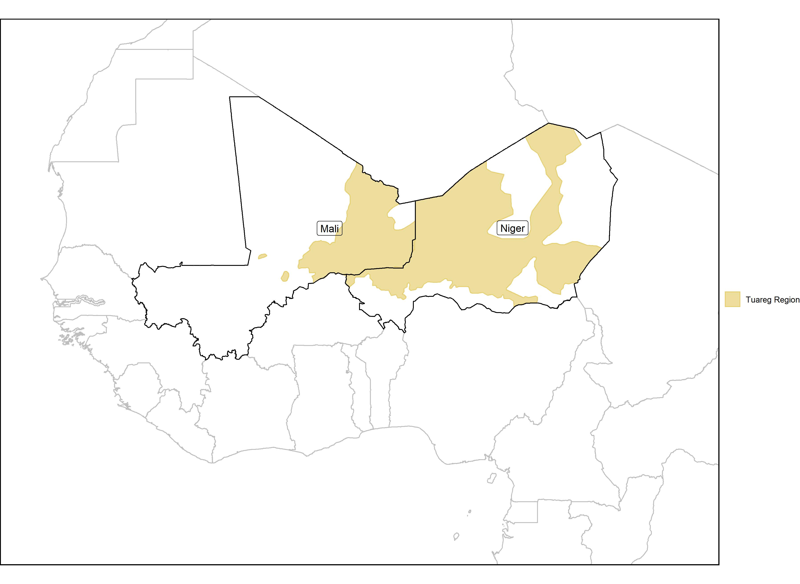

```{r setup, include=FALSE}
knitr::opts_chunk$set(echo = TRUE)
```

# Introduction

Does segmental autonomy work, how is it measured, and how can it be analyzed across polities?

### Motivation

Existing literature currently disputes: 

- What constitutes "power-sharing" as opposed to "power-dividing" or decentralization.

- When, and in which political contexts, should power-sharing be implemented.

- Whether power-sharing is a panacea, or a "tautological" concept (\cite{andeweg_consociational_2000}).

### Motivation

- Nascent literature: analyzing the global trends of individual provisions of power-sharing (\cite{ram_mutual_2014}, \cite{kelly_power-sharing_2019}).

- What about all the other provisions? 

### Mapping Conceptions of Autonomy

Literature review comprised of the following steps:

- First, see how authors discuss power-sharing, power-dividing, consociational democracy, etc. 

- Second, record what the "components" of power-sharing are. Mutual veto? Segmental autonomy? Truth commission? 

- Third, map out how all of the individual components relate across the literature.\footnote{This remains a work in progress.}

### Hypothesis

In addition to reviewing the disputes in the literature, I set out to analyze the effectiveness of segmental autonomy on a few key outcomes: 

- Social trust.
  
- Conflict incidences.
  
- Democratization and perceptions of democracy.
  
But first, let's try to identify how segmental autonomy might work...

# Case Study: Mali and Niger

In 1999, amid civil unrest, Mali implemented segmental autonomy in the form of regional elections. Niger, facing similar unrest, did not. 

\begin{table}[!htbp]
    \centering
    \setlength{\tabcolsep}{10pt}
    \renewcommand{\arraystretch}{1.5} 
    \resizebox{\textwidth}{!}{\begin{tabular}{|l|c|c|}
            \hline
            \textbf{Country}                &   \textbf{Mali}  &  \textbf{Niger}  \\ 
            \hline
            Regional Autonomy?              &   Yes            &  No              \\
            \hline
            Population (1999, millions)     &   10.6           &  10.9            \\
            \hline
            Tuareg \% of Population (2001)  &   10             &  9.3             \\
            \hline
            GDP (1999, billion USD)         &   3.4            &  2.0             \\
            \hline
            Ethnic Fractionalization (1999) &   0.8            &  0.6             \\
            \hline
            Area (million sq. km.)          &   1.2            &  1.3             \\
            \hline
            Former French Colony?           &  Yes             &  Yes             \\
            \hline 
            Political System                &  Unitary semi-presidential republic & Unitary
            semi-presidential republic  \\
            \hline
    \end{tabular}}
    \caption{Country Characteristics Around Mali's Decentralization}
\end{table}

### The Tuareg

```{r, fig.cap="Geographic Spread of Tuareg in Mali and Niger",fig.align="center",out.width="90%",echo=FALSE}

```

### What do we Learn from Process-Tracing? 

- We see autonomy disperse focal points, serve as a concession to regional minorities, and serve as a check and balance on the central government.\footnote{\cite{seely_political_2001} provides an excellent discussion on decentralization in Mali in the late 1990s.}

- In the immediate years following autonomy, modest democratic improvements in Mali. Difficult to confidently attribute this to the implementation of segmental autonomy.  

- Long-term impacts are less obvious.\footnote{http://news.bbc.co.uk/1/hi/world/africa/6982266.stm, https://www.aljazeera.com/news/2020/12/22/un-mali-probe-sees-war-crimes-crimes-against-humanity} 

# Global Trends

### Primary Results

\tiny
\subimport{../paper}{lm_full_primary_outcomes_only.tex}

### Cox Regressions

\tiny
\subimport{../paper}{dem_cox_lag5.tex}

# Looking Forward

A slate of mixed results:

- Statistically significant results are likely a product of unobserved variables. Significant relationships are also contingent on the measure of autonomy. 

- Causality is hard to claim. 

However, by no means a wasted exercise:

- Better understanding of conceptions of autonomy. 

- Null findings are findings in and of themselves. 

- Presents a roadmap for future analysis and cumulative findings. 

### Thanks

Many thanks for listening! Suggestions, critiques, and feedback are very much welcome. 

Replication package can be found [here](https://github.com/tjbrailey/SegmentalAutonomy).

Please contact me at [thomasjbrailey@gmail.com](thomasjbrailey@gmail.com).
